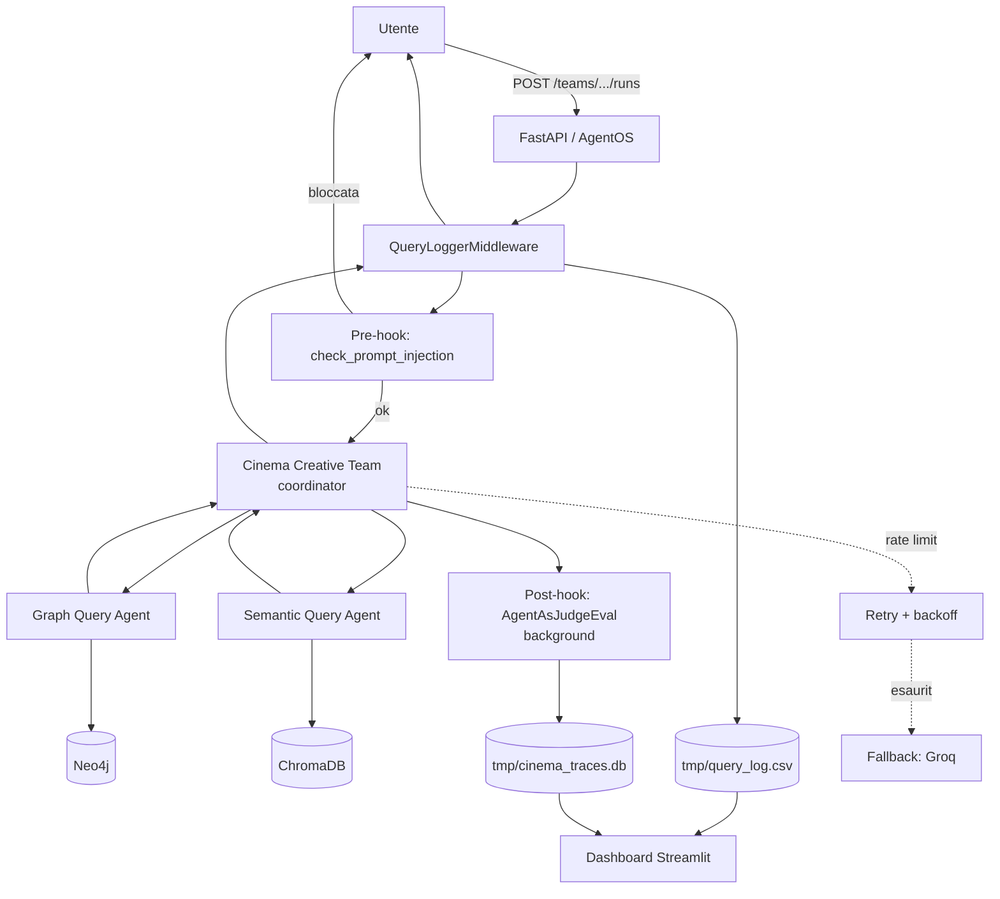

# Architettura — Cinema GraphRAG

## Obiettivo

Un sistema di intelligenza artificiale cinematografica basato su un'architettura **GraphRAG ibrida**: combina un database a grafo (relazioni strutturali tra film, attori, registi) con un database vettoriale (ricerca semantica su trame e biografie), orchestrati da un team multi-agente che risponde sia a domande fattuali precise sia a richieste creative (pitch, fusioni di trame, casting motivato da dati reali).

## Stack tecnologico

| Livello | Tecnologia |
|---|---|
| Dati strutturali | Neo4j (grafo) |
| Dati semantici | ChromaDB (vettoriale) + embedding Gemini (`gemini-embedding-001`) |
| Orchestrazione agenti | Agno (`Team`, `Agent`, hook, eval) |
| LLM | Gemini (`gemini-3.5-flash-lite`), fallback Groq (`openai/gpt-oss-120b`) |
| API | FastAPI via AgentOS |
| Dashboard | Streamlit + Plotly |
| Dataset | TMDB 5000 (film + credits) + biografie da TMDB API |

## 1 — Dati e ingestion

Il notebook `da_csv_a_neo4j.ipynb` popola entrambi i database a partire dal dataset TMDB 5000:

- **Neo4j**: nodi `Film` (vector_id, titolo, anno, trama), `Actor`/`Director` (nome, tmdb_id, biografia, data/luogo di nascita), `Genre` (nome); relazioni `ACTED_IN`, `DIRECTED`, `HAS_GENRE`.
- **ChromaDB**: un documento per film (trama arricchita con titolo/regista/cast/generi) e uno per biografia di attore/regista, entrambi embeddati con Gemini.

Le biografie vengono recuperate dinamicamente dalla TMDB API (non presenti nel CSV originale) e poi embeddate in un secondo momento. L'intero processo è **checkpointato** (skip automatico di ciò che è già stato inserito) per resistere ai limiti di quota del piano gratuito Gemini, che nella pratica hanno reso l'ingestion un processo di giorni anziché minuti.

`neo4j_export/export_neo4j.py` esporta l'intero grafo (nodi + relazioni) in CSV/JSON, utile per condividere i dati senza dover distribuire un dump binario di Neo4j o rifare l'ingestion da zero.

## 2 — Team multi-agente (`agent.py`)

```
                        ┌───────────────────────┐
                        │   Cinema Creative Team │   (coordinator, mode=coordinate)
                        │   gemini-3.5-flash-lite│
                        └──────────┬────────────┘
                    delega task     │     delega task
              ┌──────────────────┐ │ ┌──────────────────────┐
              │ Graph Query Agent│◄┴►│ Semantic Query Agent  │
              │ (Neo4j / Cypher) │   │ (ChromaDB / embedding)│
              └──────────────────┘   └───────────────────────┘
```

- **Graph Query Agent**: 7 tool custom (`cerca_film_per_attore`, `cerca_film_con_attori`, `cerca_film_per_regista`, `collaboratori_frequenti_regista`, `conta_film_per_genere`, `trova_attori_per_network`, `esegui_query_cypher` con blocklist di scrittura) + `ReasoningTools`. Istruzione critica: risponde **solo** con dati estratti dai tool, mai inventati.
- **Semantic Query Agent**: 2 tool custom (`cerca_trame_simili`, `cerca_biografia`) + accesso diretto alla `Knowledge` (ChromaDB) + `ReasoningTools`.
- **Coordinator**: non ha accesso diretto ai database, delega sempre ai due specialisti e sintetizza la risposta finale (fattuale o creativa — pitch, fusioni di trame, casting).

## 3 — Affidabilità: guardrail e valutazione automatica

- **Pre-hook** (`check_prompt_injection`): pattern-matching su tentativi di prompt injection/jailbreak (IT + EN) e comandi distruttivi verso Neo4j. Blocca la run **prima** di qualunque chiamata al modello sollevando `InputCheckError` — verificato: blocco in ~2ms, zero spreco di quota.
- **Post-hook** (`quality_eval`, `AgentAsJudgeEval`): un giudice LLM separato valuta ogni risposta (in background, non rallenta l'utente) su: lingua italiana, assenza di dati/nomi/numeri inventati, assenza di sezioni meta, casting motivato da collaborazioni reali nei pitch. Punteggio 1-10, soglia di pass 7. Risultati salvati in `tmp/cinema_traces.db`.
  - **Limite noto**: il giudice valuta solo testo di domanda/risposta, non il trace dei tool call — non può distinguere un dato realmente recuperato dal database da uno plausibile ma inventato dalla conoscenza propria del modello (riscontrato concretamente in test manuali).
- **Resilienza alla quota**: retry automatico con backoff esponenziale sui 429 (`retries=3, delay_between_retries=15`), più un **fallback a Groq** (`FallbackConfig(on_rate_limit=...)`) sul coordinator se anche i retry su Gemini si esauriscono.

## 4 — API e osservabilità

- **FastAPI/AgentOS** (`main.py`) espone il team su `/teams/{team_id}/runs` (streaming SSE o risposta singola).
- **`query_logger.py`**: middleware che intercetta ogni chiamata e la registra in `tmp/query_log.csv` — domanda, risposta, agenti coinvolti, modello/provider effettivo (utile per verificare se è scattato il fallback Groq), token input/output, costo stimato (tier a pagamento, sei sul free tier), tempo di risposta end-to-end.
- **Dashboard Streamlit** (`dashboard/`): istogramma della distribuzione dei token per domanda, filtri per combinazione esatta di agenti coinvolti e per modello, tabella dei log con drill-down sul dettaglio di ogni domanda (risposta completa, motivazione del giudice).

## Diagramma d'insieme


